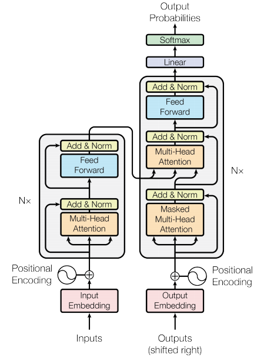
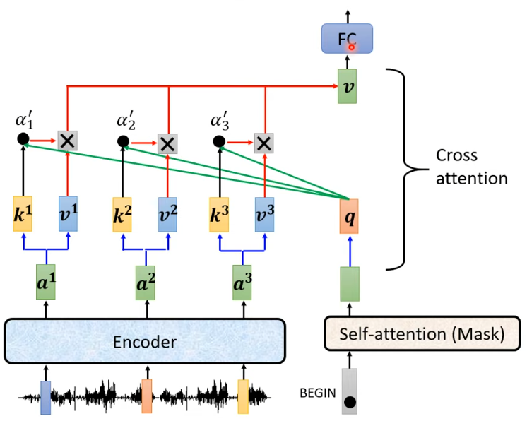

# Chinese-Taiwanese-translation-Transformer
## input
將多句輸入結合成一句，無需 [CLS] 或 [SEP]

## embedding
- Token Embedding：將每個 token 映射到對應的 768 維向量
- Positional Encoding：將每個 token 的位置應設到對應的 768 維向量  
(共兩個嵌入層矩陣，無 embedding pretrain，與 transformer train 同時更新)

## encoder
與 BERT 相同之處
- 12 或 24 層 encoder
- Multi-Head Self-Attention
- Feed-forward Network

與 BERT 不同之處
- 因為是seq2seq，所以只能同時 train encoder-decoder，無法單純 pretrain encoder (MLM、NSP)
- encoder 最終輸出是所有 token 向量 (token 數量, 768)，並傳入 decoder 當作輸入，此時會特別標記 [START] 提醒 decoder，這是第一個輸入

## decoder
- 第一個輸入會標記 [START]，最後一個輸出會標記 [BOS]

### Masked Multi-Head Self-Attention
- 只能捕捉之前生成的 token 的上下文關係，無法看到未來的 token

### Encoder-Decoder Attention (Cross Attention)

1. decoder token Q 與 encoder token K 內積
2. 再與 encoder token V 相乘，並全部相加
3. 最後仍是 768 維向量，傳入 FFN 當作輸入

### Feed-Forward Network
- 與 BERT FFN 架構相同

## output
1. 每個 token 會得到 768 維向量
2. 該 768 維向量會映射到詞彙表中
3. 經過 softmax 計算出每個單詞的概率
4. 選擇最高概率的單詞作為輸出
5. 同時將其傳入 decoder，當作下一個輸入 (轉換成 768 維向量)