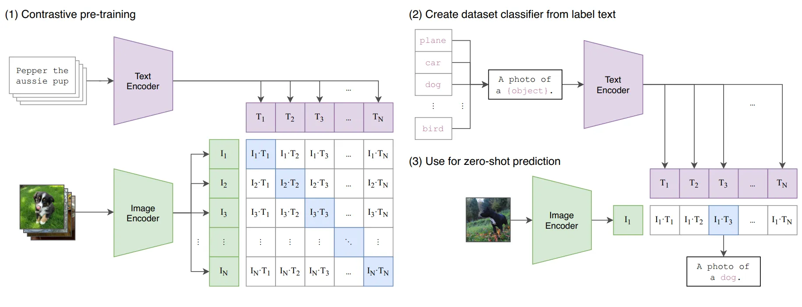

# CLIP

## 正樣本 (會更新參數)
### pretrain
文字 encoder
- 架構：ResNet 或 Transformer encoder
- input：N 句文字
- output：N 個向量

圖片 encoder
- 架構：Transformer encoder
- input：N 張 image
- output N 個向量

組成 N x N 矩陣 & 計算 loss
1. 將 N 個文字向量與 N 個圖片向量分別計算相似度，並用矩陣呈現
2. 對角線元素是正確圖片與正確文字配對的相似度
3. 採用 Contrastive Loss = 圖片_to_文字_loss (每張圖片對應到不同文字的概率) + 文字_to_圖片_loss (每句文字對應到不同圖片的概率)

### test
文字 encoder
- input：5 句正確文字 + 5 句錯誤文字
- output：5 個正確向量 + 5 個錯誤向量

圖片 encoder
- input：1 張 image
- output：1 個向量

準確度
- 圖片向量會與 10 個文字向量分別計算相似度，並取分數最高的當作預測結果

## 零樣本 (不會更新參數)
### 創建類別名稱 + prediction
1. 觀察所有 input image，自行創建多個類別名稱，如 "man", "woman", "child", "animal","landscape", ...
2. 將多個類別名稱丟入文字 encoder，得到多個類別名稱的向量
3. 將一張 image，丟入圖片 encoder，得到圖片向量
4. 將類別名稱向量與圖片向量分別計算相似度，並取分數最高的當作預測結果

## demo
  
  

  

  

  
