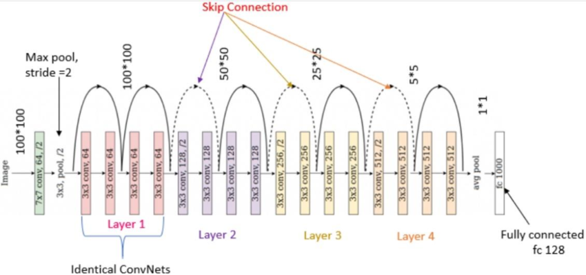
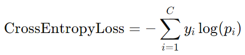

# character-classification-ResNet18
## data augmentation
- Resize：調整尺寸
- RandomRotation：隨機旋轉
- RandomHorizontalFlip：隨機水平翻轉
- add_random_noise：加入雜訊
- Pad：填充黑邊

## input
- 224 x 224 x 3 image

## output
- 50 種類別的各自概率，最大為 1，其餘為 0

## architecture

- 殘差塊：(CNN + Batch Normalization + ReLU) + (CNN + Batch Normalization)

## loss
- Cross-Entropy Loss：適合分類任務  

## key
- 殘差 (Shortcut Connection) = x + f(x-1)