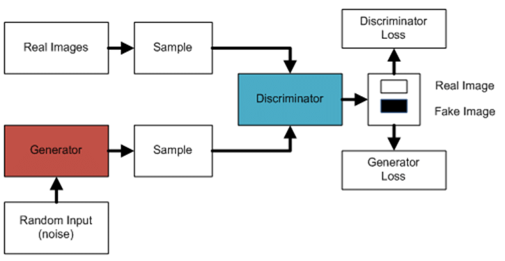
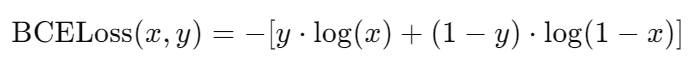

# image-generation-GAN

## Generator
- input：(batch_size, latent_dim=100) 的 random noise 向量
- output：64 x 64 x 3 image
- architecture：4 層 linear、ReLU + 最後一層 Tanh (將輸出限制在 [-1, 1]，而 ground truth 範圍也是 [-1, 1])
- loss：BCELoss(D(G(input)), 1)  

## Discriminator
- input：64 x 64 x 3 image
- output：(batch_size, 1) 的向量，介於 [0, 1]，用於判斷真偽
- architecture：4 層 linear、leakyReLU + 最後一層 Sigmoid
- loss：BCELoss(D(real_imgs), 1) + BCELoss(D(generated_imgs), 0)