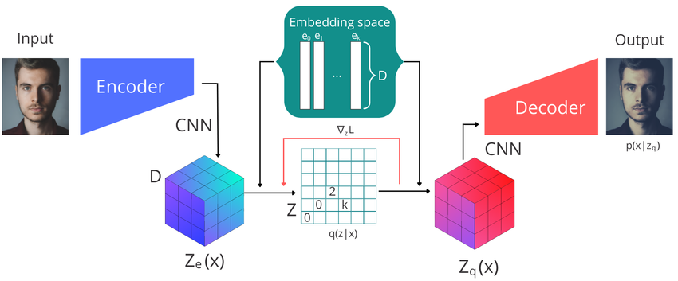
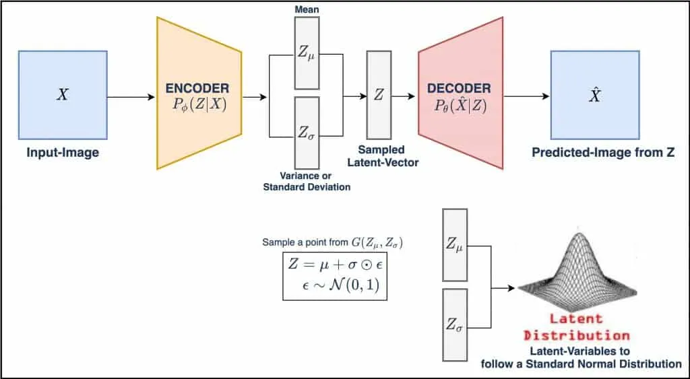
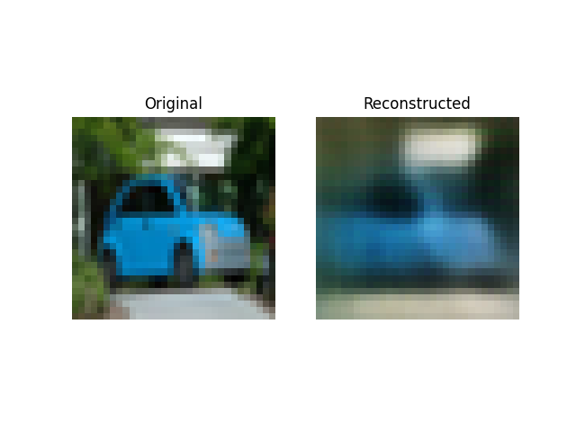

# image-reconstruction-VQVAE

- input：32 x 32 x 3 image
- output：32 x 32 x 3 image
- 架構：encoder + VectorQuantizer + decoder

## encoder
- 32 x 32 x 3 image 經過 CNN，得到 8 x 8 x 64 連續向量

## VectorQuantizer
1. Embedding Space：有 512 個 embedding 離散向量，每個向量 64 維
2. 將 [32 (batch size), 8, 8, 64] 展平成 [2048, 64]，並分別與 [512, 64] 計算相似度，並取 Embedding Space 中最相似的向量作為新向量，共作 2048 次
3. 得到新的離散向量 [2048, 64]，並將其還原成 [32, 8, 8, 64]

舉例：
- encoder output (連續向量) = [[1.2, 0.8], [4, 1.8], [11, -5]]
- Embedding Space (離散向量) = [[0, 2], [1, 1], [3, 2], [10, -7], ...]

1. 每個 encoder output 會分別與每個 Embedding Space 計算相似度
2. 並取 Embedding Space 中最相似的作為新的向量
3. 從原本的連續向量 [[1.2, 0.8], [4, 1.8], [11, -5]]，得到新的離散向量 [[1, 1], [3, 2], [10, -7]]

## decoder
- 8 x 8 x 64 離散向量經過 CNN (up sampling) 轉成 32 x 32 x 3 image

## loss
- Reconstruction Loss = MSE(input image, output image)
- Commitment Loss = NSE(encoder output 向量, Embedding Space 中被選擇的向量)，用來更新 encoder output
- Quantization Loss = NSE(encoder output 向量, Embedding Space 中被選擇的向量)，用來更新 Embedding Space

## key
- Embedding Space 中的離散向量都是參數，會根據 loss 更新
- VQ-VAE "離散向量" 優點：能提升壓縮效果、提高生成穩定性、減少模糊問題
- VAE "連續且符合高斯分布的向量" 優點：可插植性高、可生成多樣化樣本，可解釋性高
- VQ-VAE vs VAE：   
    - VQ-VAE：encoder output 會輸出連續向量，透過 Embedding Space 取得新的離散向量，例如，修復模糊影像  
    - VAE：encoder output 會輸出 "均值" 和 "標準差"，計算出符合高斯分布的新連續向量，例如，月亮從上弦月變化至下弦月的過程  

## demo
- 3 層 CNN
- epoch = 20  

