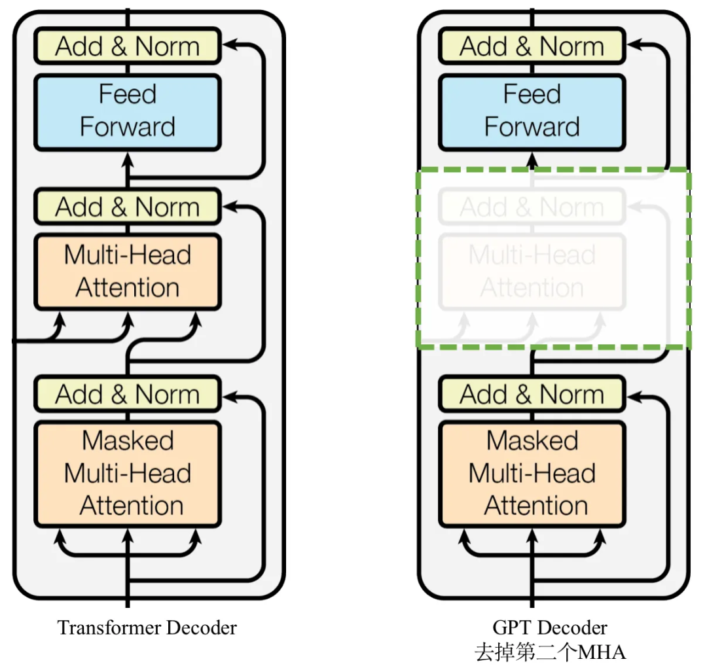

# movie-line-generation-GPT2
## input
- 逐個 token 的 embedding 向量 (768 維)

## embedding
- Token Embedding：將每個 token 映射到對應的 768 維向量
- Positional Encoding：將每個 token 的位置應設到對應的 768 維向量  
(共兩個嵌入層矩陣，無 Segment Embedding)

## embedding pretrain 
- 與 BERT 方式相同

## decoder
- 因為缺少 encoder，所以無 cross attention

## pretrain
採用 Autoregressive Modeling (自回歸模型)  
- ground truth = "我好帥"
    1. 第一次 input = "我"  
    第一次 output = "?"  
    第一次 loss = "?" 和 "好" 的 Cross-Entropy Loss
    2. 第二次 input = "我好"  
    第二次 output = "?"  
    第二次 loss = "?" 和 "帥" 的 Cross-Entropy Loss
    3. 最終 loss = 所有 loss 相加

## fine tune
- 與 pretrain 方式相同