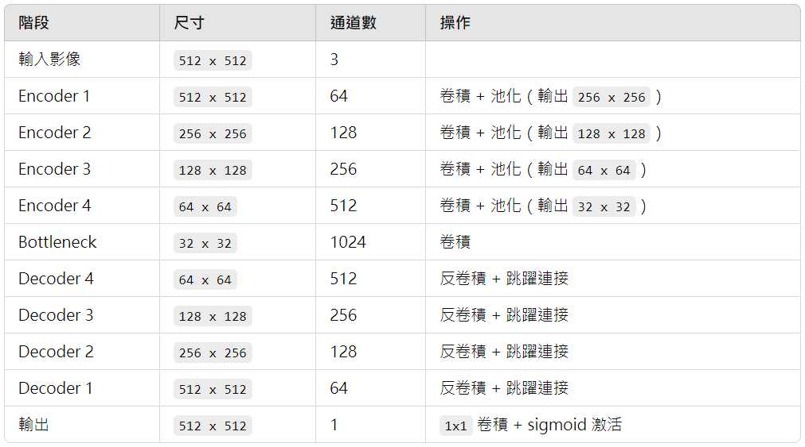
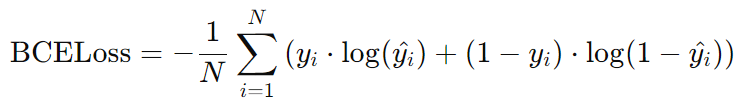
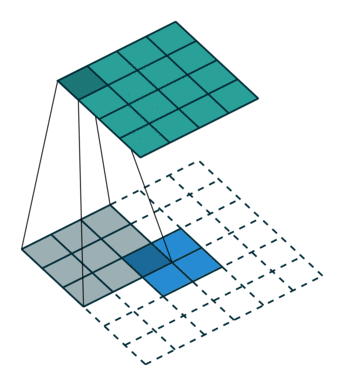
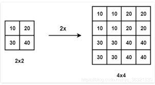

# nuclei-image-segmentation-UNet
## input
- image：512 x 512 x 3
- mask：512 x 512 x 1 (0：背景、1：目標區域)

## output
- mask：512 x 512 x 1

## architecture
- Encoder
    - 4 個 CNN block：2 層 3 x 3 CNN + relu + 2 x 2 Max Pooling
- Bottleneck
    - 2 層 3 x 3 CNN
- Decoder
    - 4 個 CNN block：1 層 2 x 2 Transposed Convolution (反卷積) + Skip Connections + 2 層 3 x 3 CNN
- output
    - 1 層 1 x 1 CNN + sigmoid (二元分類)

## loss
- BCELoss  

## key
- Transposed Convolution vs Up Sampling (上採樣)
    - Transposed Convolution：有 kernel，可更新參數  
    
    - Up Sampling：無 kernel，無法更新參數  
    

- size 變化原因
    - Max Pooling：長寬減少
    - Transposed Convolution：長寬增加
    - Skip Connections：深度相加
    - CNN kernel 個數：深度改變

- UNet 的 CNN kernel 能讓長寬保持一致
    - kernel size = 3 x 3
    - padding = 1
    - stride = 1