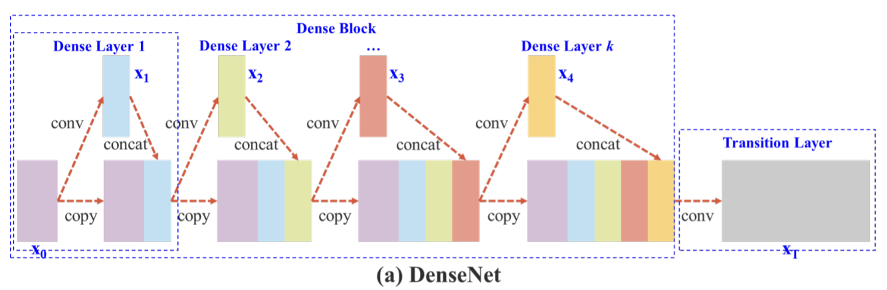
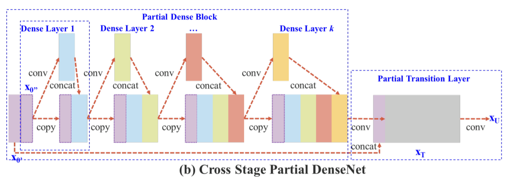

# object-detection-YOLOv5
## input
- image：416 x 416 x 3 
- .txt：[class_id, x_center, y_center, width, height]

## output
- image：416 x 416 x 3 (標註過的 image)
- .txt：[class_id, x_center, y_center, width, height, confidence]

## architecture
1. 劃分網格：將 image 分割成 s x s 個網格，每個網格負責偵測落在該網格中心最多 3 種不同的物體，若某物體橫跨多個網格，只會由物體中心的網格負責，其他網格可偵測其他物體

2. 架構
    - CSPDarknet53 (YOLOv4, YOLOv5)：
        - CNN + Residual Block + CSP
        - 輕量化 (減少參數量)、提高計算效率、提高精準度
      
    
    - Focus Layer (YOLOv5)：
        - 降低解析度 (H x W)，增加深度 (Channel)
        - 減少每次卷積時的計算量，同時保留空間資訊  
    
    - Efficient Layer Aggregation Network (YOLOv5)：
        - 多個 3 x 3 和 1 x 1 卷積組合
        - 提升特徵學習能力、減少計算資源、減少特徵冗餘  
      
    
    - Feature Pyramid Network (YOLOv3)：
        - C0 - C3 是 CNN 不同層的 feature map，P1 - P3 是經過 Upsampling + Concatenation 得到的 feature map
        - 高解析度 feature map 適合偵測小物體、低解析度 feature map 適合偵測大物體   
    

3. CNN 作用
    - 低層 feature map：提取 image 邊緣、顏色、紋理等基本信息
    - 高層 feature map：提取 image 形狀、結構、特定輪廓
    - Pooling：減少特徵空間，降低計算量，並關注全局特徵

4. Activation function：leaky ReLU

5. loss：sum-squared error  

6. 生成 Anchor Boxes (錨框) 和 bounding boxes (邊界框)
    1. 根據 K-means 學習出 3 種最適合的錨框尺寸，並為每個網格預設 3 個的 Anchor Boxes
    2. 計算 IoU：每個網格各自選出與真實框 IoU 最大的 Anchor Boxes，將其令為 "正樣本" (每格 0 - 3 個)，以學習如何調整錨框中心位置、寬度與高度
    
    3. 計算 confidence：判斷每個 Anchor box 內存在哪些類別的物體，選擇 confidence 最高的類別，當作該 Anchor box 預測的物體
    4. 使用 NMS 過濾多餘 Anchor boxes：選擇同個類別中最高 confidence 的 Anchor boxes 當基準框，計算基準框與其他同類 Anchor box 的 IoU，並刪除 IoU 超過閾值的 Anchor box (代表與基準框重疊度高)，直到無法刪除為止

## key
- 每個網格可以偵測 3 個 bounding box (需不同種類)，因此當同個網格出現 10 種類別的物體，bounding box 只能選擇 confidence 前三高的物體
    - 解決方法：
        - 將一張 image 分割出多種網格 (52 x 52、26 x 26、13 x 13)，各自經過 CNN 提取 feature map、生成 Anchor boxes 和 bounding boxes，最後將所有 bounding boxes 顯示在同張 image
- Auto Anchor：從 training data 中提取所有錨框，用 K-means 計算出 K 個最具代表性的錨框尺寸，使其盡量完整覆蓋不同大小的物體
- Anchor free：直接找出物體的中心點，並估計出 Anchor Boxes 長寬