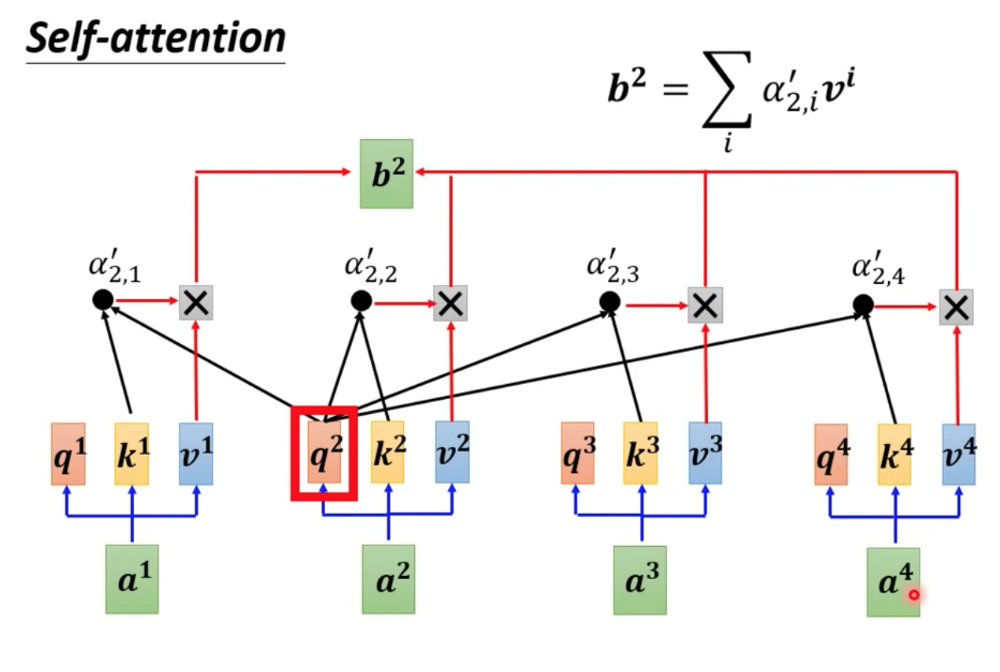

# rating-prediction-BERT
## input
[CLS] + 第一段 + [SEP] + 第二段 + [SEP] + 第三段 + [SEP]

舉例：[CLS] 貓追老鼠 [SEP] 老鼠跑了 [SEP]

## embedding
- Token Embedding：分割出每個詞 or 子詞 (包括 [CLS] 和 [SEP])-> 查詢詞彙表 (固定不變) -> 對應的 768 維向量
- Segment Embedding：區分不同段落
- Position Embedding：提供每個 token 的位置信息

最終輸入向量 = Token Embedding + Segment Embedding + Position Embedding (三個皆是 768 維向量)

舉例：
- Token Embedding：[CLS] 貓 追 老鼠 [SEP] 老鼠 跑 了 [SEP]，貓 對應到的向量 = [-0.15, 0.23, ...]
- Segment Embedding：[CLS] 0 0 0 [SEP] 1 1 1 [SEP]，segment 0 對應到的向量 = [0.1, -0.2, ...]
- Position Embedding：[CLS] 1 2 3 [SEP] 5 6 7 [SEP]，position 0 對應到的向量 = [0.02, -0.03, ...]

最終輸入向量 = [-0.15, 0.23, ...] + [0.1, -0.2, ...] + [0.02, -0.03, ...]

## embedding training
Token Embedding
1. 查找詞彙表：貓 -> ID = 1234 (固定不變)
2. 嵌入層矩陣：size = (token 數量, 768)，貓 -> 第 1234 行的 768 維向量 (隨機初始化)
3. 更新嵌入層矩陣：隨著訓練不斷更新內容
4. 最後得到穩定的嵌入層矩陣

Segment Embedding
嵌入層矩陣：size = (Segment 數量, 768)

Position Embedding
嵌入層矩陣：size = (最大序列長度, 768)

## encoder (BERT 有 12 或 24 層 encoder)
### Multi-Head Self-Attention  
- Query (查詢)：表示某個 token 對其他 token 的「查詢」需求
- Key (鍵)：表示每個 token 的「特徵」
- Value (值)：表示每個 token 的「信息內容」
  
  
1. 透過自己的 q 和其他三個 k 得出四個 α
2. 四個 α 經過 softmax 得出四個 α'
3. 四個 α' 和各自的 v 相乘，並全部相加，得出一個 b 向量
4. 此 b 代表該 token 與整句的上下文關係，並會放入下一層 Feed-Forward Network，成為新的輸入向量

### Feed-Forward Network
1. 接收 Multi-Head Self-Attention 的輸出向量，進行一次 Residual Connection (殘差連接)，加上原始輸入向量
2. 進行 Layer Normalization，使模型穩定學習
3. 傳入兩層 FC，之間有非線性激勵函數 (如 ReLU)
4. 再次進行 Residual Connection + Layer Normalization，成為輸出向量
5. 此輸出向量會傳入下一層 encoder，成為新的輸入向量

## pretrain
用大量無標記資料進行訓練
- MLM (Masked Language Modeling)：隨機遮蔽 15% token，將其改成 [MASK] 向量，並輸出 [MASK] 向量預測正確答案
- NSP (Next Sentence Prediction)：用 Segment Embedding 找出相連的 AB 兩句，輸出 [CLS] 向量預測 True；找出不相連的 AB 兩句，輸出 [CLS] 向量預測 False

## fine tune
有兩種形式  
- 單一輸出，如閱讀測驗答題、預測評分：輸出 [CLS] 向量 ([1, 768])
- 逐詞輸出，如標記單字詞性：輸出每個 token 最終向量 ([token 數量, 768])

## key
- self attention 改善 LSTM 記憶不足的問題
- 其他模型通常只考慮由左到右的關係，而 BERT 為雙向，同時考慮前後文的關係
