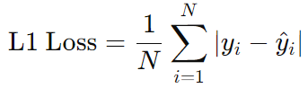

# real-fake-CycleGAN
## 2 個 Generator (生成 A image、生成 B image)
- input：64 x 64 x 3 image
- output：64 x 64 x 3 image
- architecture：
    - 2 層 CNN + ReLU
    - 2 層 ConvTranspose + ReLU
    - 1 層 CNN + Tanh

## 2 個 Discriminator (判別 A image、判別 B image)
- input：64 x 64 x 3 image
- output：7 x 7 局部概率值 (ground truth = 7 x 7 個 1)
- architecture：4 層 CNN + BatchNorm2d + LeakyReLU

## loss
1. Adversarial Loss
    - G_A2B：MSELoss(D_B(生成 B, 1))
    - G_B2A：MSELoss(D_A(生成 A, 1))
    - D_A：MSELoss(D_A(生成 A, 0)) + MSELoss(D_A(真實 A, 1))
    - D_B：MSELoss(D_B(生成 B, 0)) + MSELoss(D_B(真實 B, 1))

2. Cycle Consistency Loss
    - A：L1(G_B2A(G_A2B(真實 A)), 真實 A)
    - B：L1(G_A2B(G_B2A(真實 B)), 真實 B)  
    

3. Identity Loss
    - A：L1(G_A2B(真實 B), 真實 B)
    - B：L1(G_B2A(真實 A), 真實 A)
    
