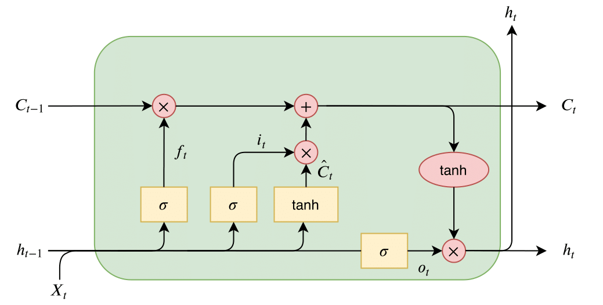
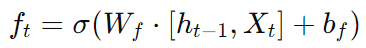
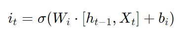
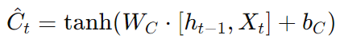
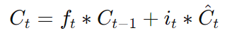
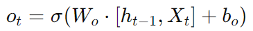
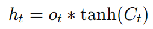

# stock-prediction-LSTM

## input
- x_t：當前 step 的輸入
- h_t-1：上一 step 的輸出
- C_t-1：上一 step 的記憶單元狀態

## operation
- forget gate：決定要 "忘記" 多少舊資訊  
  
    - f_t 是 forget gate 的輸出，取值範圍在 [0, 1] 之間，使用 Sigmoid 函數（σ）計算
    - 當 f_t 愈接近 0，表示相應的記憶會被遺忘：愈接近 1，則表示會保留

- input gate：決定要 "加入" 多少舊資訊  
  

- Candidate Memory Cell (候選記憶單元)："生成" 候選的記憶內容  

- 更新記憶單元的狀態  

- output gate：決定最終要輸出多少記憶資訊  
  

- hidden state  

## output
- C_t：更新後的記憶單元狀態，將被傳遞到下一 step
- h_t：當前 step 的輸出，也會傳遞到下一 step

## key
- sigmoid vs tanh
    - sigmoid：輸出範圍在 [0, 1] 之間，適合作 "控制"，決定要保留或捨棄多少資訊
    - tanh：輸出範圍在 [-1, 1] 之間，適合作 "生成"，生成要保留或捨棄的資訊內容

- output 形式
    - 只輸出最後 step 的 h_t：例如，學習前 100 天的股價，預測第 101 天的股價
    - 輸出每個 step 的 h_t：例如，輸入 "我好帥"，翻譯成 "I am handsome"

- 整個模型會共用一顆 LSTM 單元，只是 step 會一直更新