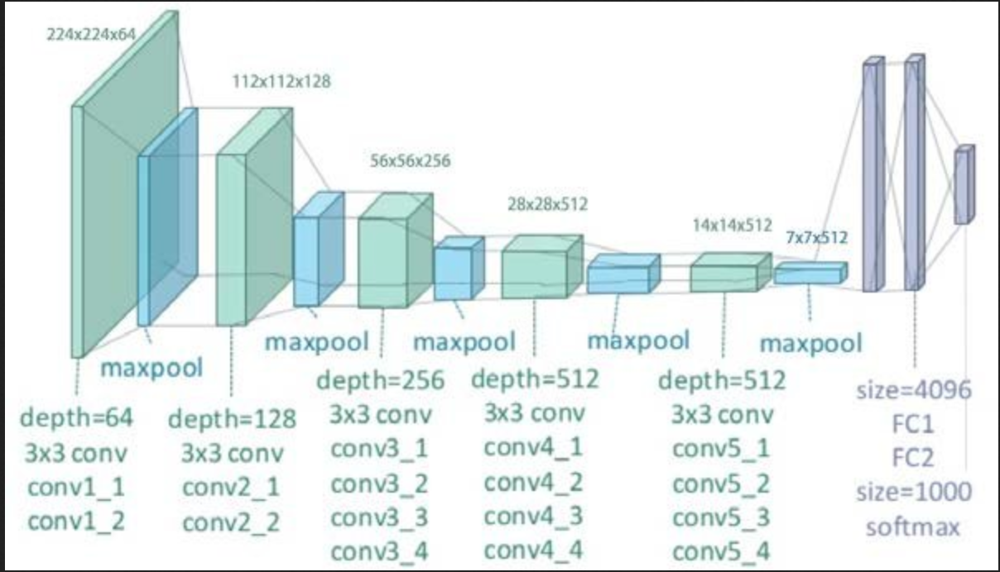

# style-transfer-VGG19
## input
- content image：244 x 244 x 3
- style image：244 x 244 x 3
- generate image：244 x 244 x 3 (可以是 random image 或 content image)

## output
- generate image：244 x 244 x 3

## architecture
- 16 層 CNN + Max Pooling
    - 5 個 CNN block：3 x 3 CNN kernel + 2 x 2 Max Pooling

- 3 層 FC + softmax
    - 用於分類，而 style transfer 捨棄 FC



## feature extractor
- content layer：conv4_2
- style layer：conv1_1、conv2_1、conv3_1、conv4_1 和 conv5_1

## loss
- content loss：計算 content image 和 generate image 在 content layer 的 MSE
- style loss：計算 style image 和 generate image 在各個 style layer 的 Gram matrix MSE
    - Gram matrix：將特徵向量 (C x H x W) 展平至 2D (C 個 H x W) 並進行內積，得到 channel 之間的相關性

## key
- 為什麼 output size 不是 7 x 7 x 512，而是 244 x 244 x 3？
    - 因為 VGG19 會鎖定權重，所以 backward() 不是更新參數，而是計算每個 pixel 的梯度，並直接修改 generate image
    ```python
    # 鎖定 VGG19 權重，不進行訓練
    for param in vgg.parameters():
        param.requires_grad = False
    ```